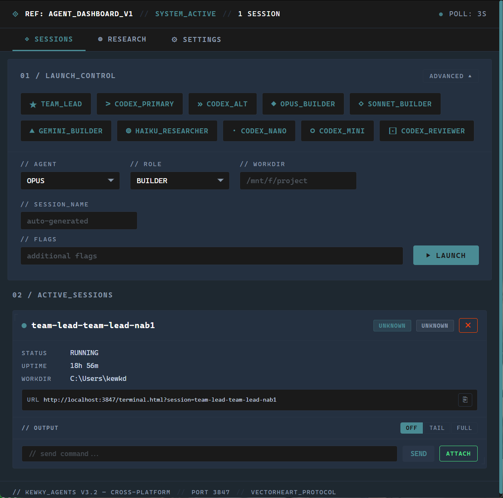

# Kewky Agents

Launch, monitor, and control AI coding agents from anywhere — your phone, a friend's laptop, or across your own machines. One dashboard, every platform.



## The Idea

You have AI agents (Claude, Codex, Gemini). You want to run several at once, on different machines, and keep tabs on all of them without being chained to one terminal. Maybe you're on your phone at lunch and want to check if your Opus agent finished that refactor. Maybe you're at a friend's place and want to spin up a Haiku researcher on your home PC.

Kewky Agents is a web-based control panel that makes all of that work. It runs on your machine (or any machine), spawns agents as real terminal processes, and gives you a browser UI to manage them. Since it's a web server, anyone with the URL can connect — your phone on the same wifi, your tablet over Tailscale, or another machine across the internet.

**What it is right now:**
- A multi-platform agent launcher with one-click presets
- A real-time status monitor that watches agent terminal output
- A full browser-based terminal (xterm.js) so you can interact with any agent from any device
- A cross-platform spawner that can launch agents locally, inside WSL, or on remote machines over SSH
- A research deployment tool for sending multiple agents to investigate a topic in parallel

**What it is not (yet):**
- There's no inter-agent communication system. We had one, ripped it out — stdin injection is janky and unreliable. The plan is to build proper comms later, likely through Discord bots where each agent gets its own identity and they can DM each other in channels. That's a future feature.
- There's no authentication on the dashboard itself. If someone can reach the port, they can control your agents. Use Tailscale, a VPN, or firewall rules to limit access.

## Quick Start

```bash
git clone https://github.com/KewkLW/kewky-agents.git
cd kewky-agents
```

Then tell your AI assistant:

> Set up Kewky Agents. Read the README and docs/ folder, install dependencies, and configure it for my machine.

That's it. Your AI reads the setup guides, installs what's needed, and gets everything running.

Or do it manually:

```bash
npm install
npm start
# Open http://localhost:3847
```

## Why This Exists

AI CLI tools are great, but they each run in one terminal on one machine. When you want to run five agents across two machines and check on them from your phone, you're juggling SSH sessions, tmux panes, and hoping you remember which terminal is which.

This dashboard gives you:

**One place to launch everything** — Click a button, agent starts. Preset configs for every model and role combo you use.

**Real-time visibility from any device** — Every agent's status (working, idle, thinking, stuck, error) updates live in the browser. Open it on your phone and you see what all your agents are doing right now.

**Full terminal access from anywhere** — Click ATTACH on any agent card and you get a real interactive terminal in your browser. Send commands, read output, interact exactly like you would in a local terminal. Works on mobile.

**Agents across machines** — Your Windows PC runs Opus and Codex. Your Mac runs Sonnet. Your Pi runs Haiku. All show up in one dashboard, all controllable from one URL.

## How It Works

### Agent Spawning

Each agent is a real pseudo-terminal process (via `node-pty`). The agent CLI thinks it's running in a normal terminal — because it is. The dashboard just wraps it with output capture and a WebSocket bridge for the browser.

Spawning adapts to the target platform:
- **Local (native)**: `cmd.exe /c` on Windows, `$SHELL -c` on Mac/Linux
- **WSL**: `wsl.exe -d Ubuntu-24.04 -- bash -l -c` (Windows hosts only)
- **SSH to Linux**: `ssh -t user@host bash -l -c 'command'`
- **SSH to macOS**: same, but with Homebrew PATH setup
- **SSH to Windows**: `ssh -t user@host command` (OpenSSH uses cmd.exe)

### Status Detection

The dashboard reads the last few lines of each agent's terminal output every 3 seconds and pattern-matches to determine state. No modification to the agents needed — it just watches what they print:

- Claude spinning? → `working`
- Codex showing `>`? → `idle`
- Gemini says "Type your message"? → `idle`
- Error in the last line? → `error`
- Asking for permission? → `waiting_approval`

### Browser Terminal

When you click ATTACH, the browser opens an xterm.js terminal connected to the agent's PTY via WebSocket. Full bidirectional I/O — keystrokes go to the agent, output streams back. Multiple clients can watch the same session simultaneously. Works on desktop and mobile browsers.

### Research Missions

The Research tab lets you select multiple agents, give them a research topic, and deploy them all at once. Each agent independently investigates and writes findings to a shared output directory. When they're done, the dashboard combines their reports into a viewable document.

## What Gets Sent Where

**Full transparency:**

- **Agent CLIs** connect to their cloud APIs (Anthropic, OpenAI, Google) using OAuth tokens from your subscription. The dashboard doesn't touch these connections.
- **The dashboard server** runs on your machine. No telemetry, no phone-home, no analytics.
- **SSH sessions** are standard SSH connections to your configured remote hosts.
- **The browser UI** loads from the dashboard server. All static assets (xterm.js, marked.js) are bundled locally — no CDNs.
- **No API keys** anywhere. All AI access is through OAuth/subscription auth managed by each CLI tool.

## Prerequisites

- **Node.js 18+** with native addon support (for `node-pty`)
- **Git** on PATH
- **At least one AI CLI tool** installed and authenticated:
  - Claude: `npm i -g @anthropic-ai/claude-code` then `claude` to sign in
  - Codex: `npm i -g @openai/codex` then `codex` to sign in
  - Gemini: `npm i -g @google/gemini-cli` then `gemini` to sign in

### Build Tools (for node-pty native compilation)

| Platform | Requirement |
|----------|-------------|
| **Windows** | Visual Studio C++ Build Tools or `npm i -g windows-build-tools` |
| **macOS** | `xcode-select --install` |
| **Linux** | `sudo apt install build-essential python3` |

## Configuration

Copy `.env.example` to `.env`:

```bash
cp .env.example .env
```

### Core

| Variable | Default | Description |
|----------|---------|-------------|
| `AGENT_DASH_PORT` | `3847` | Server port |
| `TAILSCALE_HOST` | `localhost` | Hostname for remote terminal URLs (set to Tailscale IP for mobile access) |

### Remote Machines (SSH)

Spawn agents on other machines. Format: `REMOTE_HOST_<NAME>=user@host:port:os`

```bash
REMOTE_HOST_PC=kewkd@192.168.1.10:22:windows
REMOTE_HOST_MAC=user@macbook.local:22:macos
REMOTE_HOST_PI=pi@raspberrypi.local:22:linux
```

The `os` field tells the dashboard how to wrap commands on the remote end. Defaults to `linux` if omitted.

Each remote machine needs: SSH server with key auth, Node.js, and at least one CLI tool installed and signed in. See `docs/` for per-agent setup guides.

### WSL (Windows only)

```bash
WSL_DISTRO=Ubuntu-24.04
```

WSL presets appear automatically when WSL is detected. CLI tools must be installed inside the WSL distro.

## Mobile & Remote Access

The dashboard has no built-in authentication. Anyone who can reach the port can control your agents. Use [Tailscale](https://tailscale.com) (free for personal use) to create a private network that only your devices can access — no port forwarding, no firewall rules, no exposed ports.

### Setting Up Tailscale

1. **Install Tailscale** on the machine running the dashboard:
   - **Windows**: Download from [tailscale.com/download](https://tailscale.com/download) or `winget install Tailscale.Tailscale`
   - **macOS**: `brew install tailscale` or download from the App Store
   - **Linux**: `curl -fsSL https://tailscale.com/install.sh | sh`

2. **Install Tailscale on your phone/tablet**:
   - iOS: [App Store](https://apps.apple.com/app/tailscale/id1470499037)
   - Android: [Play Store](https://play.google.com/store/apps/details?id=com.tailscale.ipn)

3. **Sign in on both devices** with the same account (Google, Microsoft, GitHub, etc.). They'll automatically join the same private network (tailnet).

4. **Find your machine's Tailscale hostname**:
   ```bash
   tailscale status
   ```
   Look for your machine's name in the first column (e.g., `kewk-1`, `my-desktop`). The second column is the Tailscale IP (e.g., `100.x.y.z`). Either works as a hostname.

5. **Set `TAILSCALE_HOST` in your `.env`**:
   ```bash
   # Use the machine name from tailscale status
   TAILSCALE_HOST=kewk-1
   ```

6. **Restart the dashboard** (`npm start` or kill and relaunch). The startup banner will confirm:
   ```
   // TAILSCALE_HOST: kewk-1
   ```

7. **Open the dashboard from your phone**:
   ```
   http://kewk-1:3847
   ```
   That's it. Your phone resolves the Tailscale hostname automatically via MagicDNS. Full dashboard access — launch agents, monitor status, open interactive terminals, all from mobile.

### Why Not Just Use Local IP?

You *can* use `http://192.168.1.x:3847` on the same wifi, but:
- It breaks when you leave your home network
- It changes if your router reassigns IPs
- Anyone on the same wifi can reach it

Tailscale gives you a stable hostname that works from anywhere — your couch, a coffee shop, a friend's house — and only devices signed into your tailnet can connect.

## Settings

The Settings tab in the browser lets you toggle features:

| Toggle | Controls |
|--------|----------|
| WSL Presets | WSL agent launch buttons |
| Remote Hosts | SSH remote agent presets |
| Research Tab | Multi-agent research deployment |
| Advanced Launch | Manual launch form with custom flags |

Settings persist in your browser's localStorage.

## API

The dashboard exposes a REST API that agents and scripts can use:

| Endpoint | Method | Description |
|----------|--------|-------------|
| `/api/config` | GET | Dashboard config and platform info |
| `/api/agents` | GET | Active agents with status, type, platform |
| `/api/team/status` | GET | All session statuses |
| `/api/team/launch` | POST | Launch agent: `{ agent, role, platform, host }` |
| `/api/team/send` | POST | Send to session stdin: `{ session, message }` |
| `/api/team/output/:session` | GET | Read agent output |
| `/api/team/kill` | POST | Kill session: `{ session }` |

`AGENT_DASHBOARD_URL` is injected into every spawned agent's environment so they can reach the API.

## Architecture

```
server.js              Express + WebSocket server
src/sessions.js        PTY session lifecycle (create/kill/write/resize)
src/config.js          Agent definitions, presets, env config
src/platform.js        Platform detection (local OS, WSL, SSH remotes)
src/detect.js          Status detection from terminal output
src/research.js        Multi-agent research missions
src/auto-nudge.js      Auto-nudge idle agents
src/auto-distribute.js Task auto-distribution
src/worktree.js        Git worktree detection
public/                Static frontend (app.js, terminal.html, styles)
docs/                  Agent CLI setup guides
```

## Docs

- [docs/setup-claude.md](docs/setup-claude.md) — Claude CLI install, auth, flags, remote setup
- [docs/setup-codex.md](docs/setup-codex.md) — Codex CLI install, auth, multi-account, remote setup
- [docs/setup-gemini.md](docs/setup-gemini.md) — Gemini CLI install, auth, Ctrl+Y quirk, remote setup
- [docs/setup-multi-account.md](docs/setup-multi-account.md) — Running multiple accounts for parallel rate limits

## License

MIT
